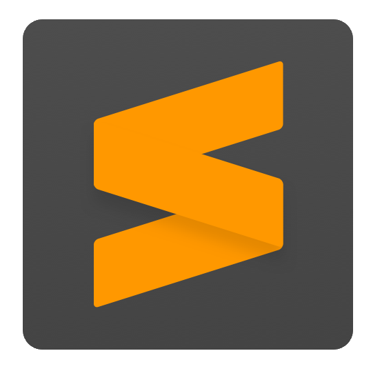

## Hi 👋, I'm Stephen Adams
- 💻 I’m currently working on my next project
- 🏫 I’m currently learning Java
- 🌷 Fun fact: I love walking in the countryside
- 📫 How to reach me: contact@techery.cloud
- 😄 Pronouns: He/Him

<h3>Languages and Tools:</h3>

<h3>Preffered Code Editors:</h3>

